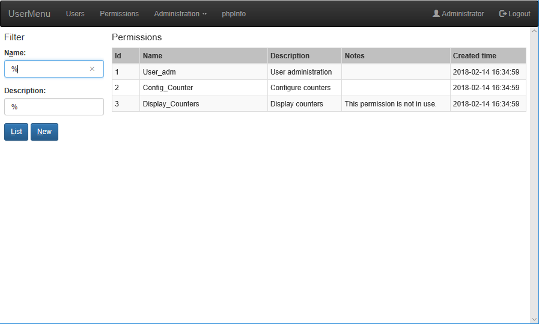
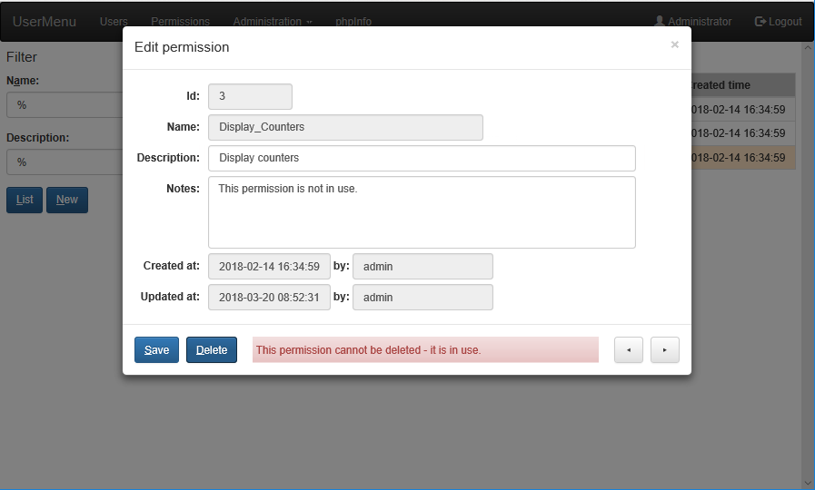

# phpUserExercise
PHP website with user login and permissions

## Table view of registred users

## Modal dialog to edit a user

## Table view of permissions

## Modal dialog to edit a permission

